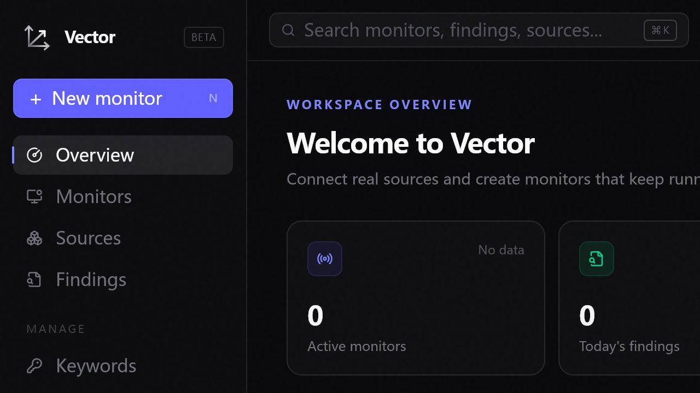

<p align="center">
  
</p>

<h1 align="center">Vector</h1>
<p align="center"><strong>Research Automation Platform</strong></p>

## English

Vector is a desktop-first research information automation platform. Configure a monitor once, choose real internet sources, define keywords and filters, and run a reproducible scan when needed.

Vector is not an RSS reader and does not generate AI summaries or recommendations. Findings come from provider data and retain the original source URL.

### Highlights

- Monitor wizard with schedule, timezone, sources, keywords, exclusions, Regex and filters
- Real provider execution for arXiv, PubMed, OpenReview, Crossref, OpenAlex, GitHub, Hugging Face Papers, Semantic Scholar and custom RSS/Atom feeds where upstream access is available
- Findings with source icon, fetched time, publication time, authors, institutions, subjects and original link
- Execution history with success, partial success, failure, timing, scan counts and error details
- Editable keyword and multi-channel notification configuration
- Chinese / English interface switch
- Electron desktop application with a dark-first UI

### Screenshot



### Run locally

```bash
npm install
npm run dev
```

Open `http://localhost:3000`.

```bash
npm run typecheck
npm run lint
npm run build
```

### Build the desktop app

```bash
npm run desktop
```

The Windows portable build is emitted under `release/` when electron-builder is configured for the current environment.

### Current status

Upstream providers may enforce rate limits or require credentials. Vector reports the actual provider error instead of fabricating results. Email delivery is intentionally not exposed yet.

### About

Gray Medical Computing Laboratory · Shenzhen Gray Technology Co., Ltd.  
[www.gray.org.cn](https://www.gray.org.cn)

## 中文

Vector 是一款桌面优先的科研信息自动化平台。用户配置一次监控器，选择真实互联网来源，设置关键词和过滤规则，即可按需执行可复现的扫描。

Vector 不是 RSS 阅读器，也不会生成 AI 摘要或推荐。所有发现内容均来自 Provider 的真实数据，并保留原始链接。

### 功能

- 监控器向导：执行周期、时区、来源、关键词、排除词、正则表达式和过滤规则
- 支持 arXiv、PubMed、OpenReview、Crossref、OpenAlex、GitHub、Hugging Face Papers、Semantic Scholar 和自定义 RSS/Atom
- Findings 展示来源图标、抓取时间、论文发布日期、作者、单位、Subjects 和原始链接
- 执行历史展示成功、部分成功、失败、耗时、扫描数量和错误详情
- 关键词和多通知渠道可编辑、保存和持久化
- 支持中文和英文界面切换
- Electron 桌面应用，采用深色优先设计

### 本地运行

```bash
npm install
npm run dev
```

打开 `http://localhost:3000`。

```bash
npm run typecheck
npm run lint
npm run build
```

### 构建桌面版

```bash
npm run desktop
```

在当前环境中运行 electron-builder 后，Windows 便携版会输出到 `release/` 目录。

### 当前状态

上游 Provider 可能限流或要求认证。Vector 会显示真实错误，不会伪造结果。当前暂不提供 Email 发送渠道。

### 关于

灰质医学实验室 · 深圳灰质科技有限公司  
[www.gray.org.cn](https://www.gray.org.cn)

## License

MIT License. See [LICENSE](LICENSE).
